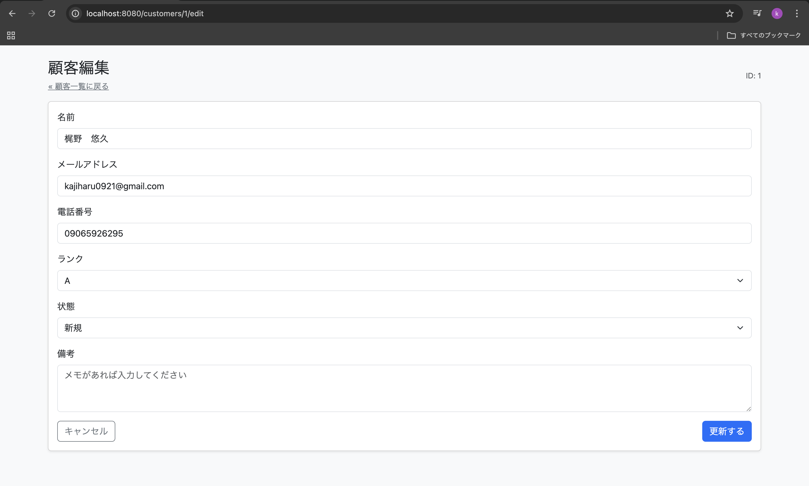
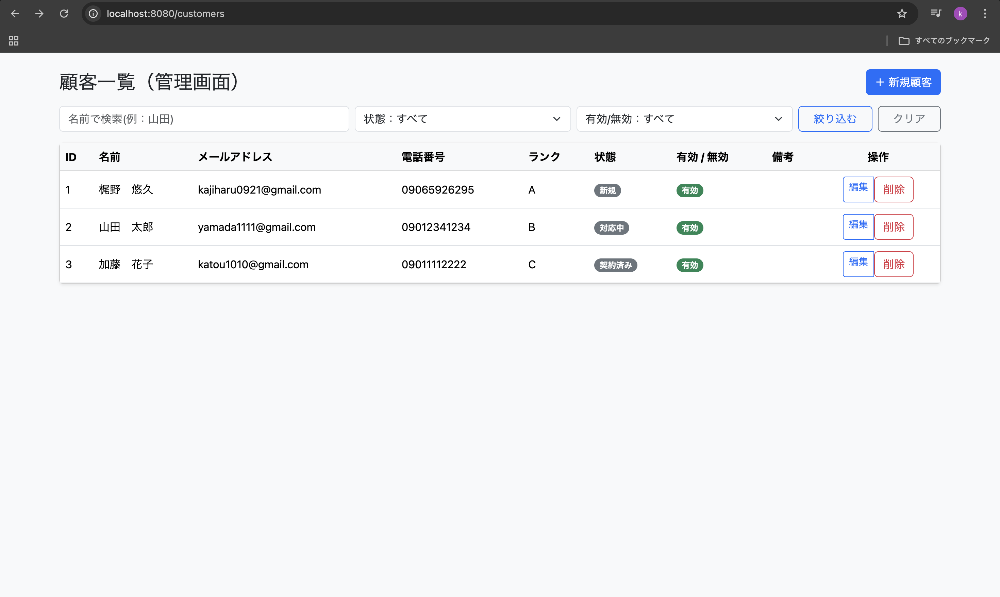

# CustomerManager　— 顧客管理ミニアプリ


## はじめに
CustomerManager は、顧客情報を一元管理するための 学習用 顧客管理Webアプリ です。
顧客の登録・編集・削除・検索を行うことができ、
Service層の設計 や テストコードの作成 を意識して実装しました。

ShiftManager（シフト管理アプリ）で学んだ
Spring MVC の基礎をベースに、
より実務に近い構成へのステップアップ を目的としています。

チャットGPTに上司として依頼メールを投げてもらい、それをもとに作成しました。

## 上司からの依頼メール

```bash
件名：顧客管理アプリ試作のお願い

梶野くん

お疲れ様です。
顧客情報を管理する簡易的なWebアプリの試作をお願いしたく連絡しました。

現在、顧客情報がExcelなどで分散管理されており、
一覧での確認や検索がしづらいという課題があります。

まずは以下の基本機能を備えたアプリを作成してください。

【依頼内容】
・顧客の登録／編集／削除
・顧客一覧の表示
・キーワードやステータスによる検索
・アクティブ／非アクティブの管理

【技術要件】
・Spring Boot
・Thymeleaf を用いた画面実装
・H2 Database を使用
・学習目的のため、設計の意図が分かる構成にすること

完成後、動作確認できる状態で見せてください。

よろしくお願いします。

（上司）
```

---

## 機能


### シフト管理
- 顧客一覧表示
- 顧客新規登録
- 顧客編集
- 顧客削除
- 顧客検索





---

## 技術スタック

- **Spring Boot 3.5.8**
- **Thymeleaf**
- **H2 Database**
- **Spring Data JPA / Hibernate**
- **Maven**
- **Java17**

---

## アーキテクチャ構成

```bash
Controller
  ↓
Service（業務ロジック）
  ↓
Repository（DBアクセス）
```
- Controllerではリクエスト処理に専念
- 業務ロジックではサービス層に集約

### セットアップ
#### 1 Clone

```bash
git clone https://github.com/kajiharuhyyy/CustomerManager.git
cd CustomerManager
```


#### 2 Run

``` bash
./mvnw spring-boot:run
```

#### 3 Access

``` bash
http://localhost:8080/customers
```
---

## 学習したこと

- Spring MVC（Controller / Form / View）の理解
- Service 層を用いた責務分離
- Spring Data JPA を使ったCRUD実装
- Thymeleaf のフォームバインディング
- Bean Validation による入力チェック
- リクエスト層のテストコード作成

---

## 今後の拡張予定

- 客操作履歴の管理
- ログイン／認可機能（Spring Security）
- API 化（フロントエンド分離）
- 本番DB（MySQL 等）対応
- デプロイ（AWS / Render 等）


## 作者
**梶野　悠久**


